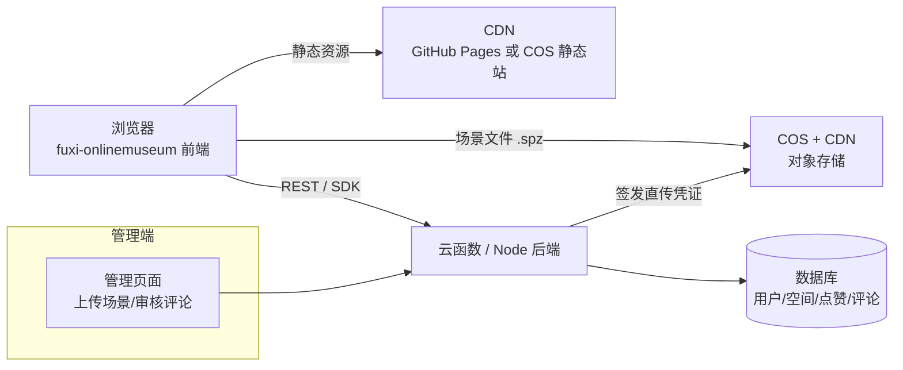

# fuxi-onlinemuseum 后端选型文档

> 项目现状：Arrival.Space 风格的 3D 高斯泼溅查看器（纯静态站，部署于 GitHub Pages）。
> 本文分析"完善成完整产品"所需的后端能力，对比候选方案并给出推荐路线。

---

## 1. 现状盘点

目前已实现（纯前端）：3D 高斯泼溅渲染、第一人称漫游（WASD/鼠标视角/跳跃）、品牌化 UI（作者卡 / 菜单抽屉 / 搜索浮层）。

目前是"假的"（写死在代码里的）：

| 功能 | 现状 | 完善后需要 |
|---|---|---|
| 点赞 49 / 收藏 32 | 写死的数字，点击只改本地 | 真实计数 + 防重复（按用户/设备） |
| 评论 13 | 只有一个数字和 toast | 评论列表 + 发表 + 删除 |
| 登录 | 菜单里一个按钮 | 真实账号体系（手机号/微信） |
| 场景 | 单个写死的 scene.ply | 多场景上传 / 管理 / 切换 |
| 分享 | 复制链接 | 分享统计、OG 卡片动态生成 |
| 私信 / 认领空间 | 占位按钮 | 站内信、空间认领流程 |

---

## 2. 关键技术约束（决定选型的三个事实）

### 2.1 场景文件很大，这是本项目后端的"主要矛盾"

- 当前 `scene.ply` = **46MB**；SPZ 压缩格式只有 **11MB**（同场景）
- 一千次浏览 ≈ 10~46GB 流量。**绝不能**让业务后端直接伺服这些文件
- 结论：**对象存储 + CDN** 是必选项，业务后端只管"元数据 + 鉴权 + 签发直传凭证"
- 上线前把 PLY 转成 SPZ（项目里 `tools/spz2ply.mjs` 的逆过程），流量直接省 75%

### 2.2 受众在国内（中文界面 / 微信分享）

- Firebase 在国内不可用；Supabase 国内访问不稳定（时好时坏）
- 腾讯云开发 CloudBase、LeanCloud 在国内稳定，但正式商用需要**域名 + ICP 备案**
- GitHub Pages 国内可访问但速度一般，正式运营建议迁到国内静态托管（或双线）

### 2.3 单人维护

- 没有专职运维 → 优先"托管服务多、自己管的东西少"的方案
- 前端是 JS 生态 → 自建时选 Node.js 可以前后端同语言

---

## 3. 候选方案对比

| 维度 | A. 云开发 BaaS<br>（腾讯 CloudBase / LeanCloud） | B. 自建轻后端<br>（Node.js + PostgreSQL + COS/OSS） | C. 海外全托管<br>（Supabase + Vercel） |
|---|---|---|---|
| 上线速度 | ⭐⭐⭐⭐⭐（3~7 天） | ⭐⭐⭐（2~4 周） | ⭐⭐⭐⭐（1~2 周） |
| 运维负担 | 几乎为零 | 中等（服务器/备份/监控自己管） | 几乎为零 |
| 国内访问 | ✅ 稳定 | ✅ 稳定 | ❌ 不稳定 |
| 大文件方案 | 自带存储+CDN（按量付费） | COS/OSS + CDN（最便宜最可控） | Supabase Storage（海外 CDN） |
| 免费额度 | CloudBase 基础版有免费额度；LeanCloud 开发版免费 | 无（服务器 ~50-100 元/月） | 免费档够用 |
| 数据可迁移性 | 中（有导出，但绑平台 API） | ✅ 完全自主 | 中 |
| 认证 | 内置（手机号/微信） | 自己写或接微信开放平台 | 内置（但不适合国内微信登录） |
| 适合阶段 | 验证期 / 中小规模 | 确定要做大 / 需要深度定制 | 受众在海外 |

---

## 4. 推荐路线（三阶段）

### 第一阶段：BaaS 快速把互动做"真"（1~2 周）

**推荐：腾讯云开发 CloudBase**（国内稳定 + 微信生态近 + 免费额度够验证）。
LeanCloud 是等价的备选，API 更简洁。

- 开两个集合/表：`users`、`spaces`、`likes`、`favorites`、`comments`
- 前端加一个 `api.js` 适配层，把写死的 49/13/32 换成真实读写
- 登录直接用 CloudBase 内置的手机号验证码（或先做"匿名设备 ID"最低成本版）
- GitHub Pages 继续当地址托管，跨域调用云函数（配置 CORS 白名单）

### 第二阶段：场景文件上对象存储 + CDN（与第一阶段并行或紧随）

- 腾讯云 **COS 存储桶** 存放 `scene.spz`（11MB），挂 **CDN 域名**
- 上传走"后端签发临时凭证 → 前端直传 COS"，业务服务器不过流量
- 场景元数据（点数、朝向修正角度、初始相机）存数据库，查看器启动时先拉 JSON 再加载场景
- 顺手把 PLY→SPZ 转换做成上传流水线的一步（服务端跑 `spz2ply` 的逆过程）

### 第三阶段：规模/定制需求出现时，再上自建后端（可选）

- **NestJS + PostgreSQL + Redis**，Docker 部署到腾讯云轻量服务器
- 触发条件：需要复杂权限/审核流、私信、推荐算法、BaaS 费用超过自建成本时
- 因为第一阶段的数据模型是按下面第 6 节设计的，迁移主要是"换 API 实现"，前端改动很小

> 海外受众路线（备选）：Supabase（数据库+认证+存储）+ Vercel（前端），全免费额度起步，
> 但场景大文件的海外 CDN 对国内用户不友好，二选一前先明确受众。

---

## 5. 推荐架构（第二阶段形态）



---

## 6. 核心数据模型（BaaS 和自建通用）

```
users        用户
  id, nickname, avatar_url, phone/wechat_openid, created_at

spaces       空间（一个场景 = 一个空间）
  id, title, creator_id → users, scene_key(对象存储路径),
  point_count, format(spz/ply), floor_y, camera_json,
  like_count, favorite_count, view_count, status(draft/published), created_at

likes        点赞（user_id + space_id 唯一约束 → 天然防重复）
  user_id, space_id, created_at

favorites    收藏（同上）
comments     评论
  id, space_id, user_id, content, status(正常/已删除), created_at

scene_files  上传记录
  key, size, format, point_count, uploader_id, created_at
```

要点：`like_count` 这类计数在表上冗余一份（写入时 +1/-1），读取永远不打点赞明细表。

---

## 7. API 草案（REST）

| 方法 | 路径 | 说明 |
|---|---|---|
| POST | `/api/auth/login` | 手机号验证码 / 微信 code 登录，返回 token |
| GET | `/api/spaces/:id` | 空间详情（含计数、作者信息） |
| POST | `/api/spaces/:id/like` | 点赞 / 再点取消（toggle） |
| POST | `/api/spaces/:id/favorite` | 收藏 / 取消 |
| GET | `/api/spaces/:id/comments?cursor=` | 评论分页 |
| POST | `/api/spaces/:id/comments` | 发评论（需登录，限长 500 字） |
| POST | `/api/scenes/upload-url` | 申请 COS 直传凭证（需登录，校验大小/格式） |
| POST | `/api/spaces` | 创建空间（关联已上传的 scene_key + 相机参数） |

---

## 8. 成本粗估（月）

| 项 | 第一阶段（CloudBase） | 第二阶段加 COS+CDN | 自建（对照） |
|---|---|---|---|
| 计算/后端 | 免费额度 ~ 39 元 | 同左 | 轻量服务器 50~112 元 |
| 数据库 | 含在额度内 | 同左 | 同服务器 |
| 存储 | 小 | 11MB×场景数（可忽略） | 同左 |
| CDN 流量 | 小 | ≈0.2 元/GB（1000 次浏览 ≈ 11GB ≈ 2~3 元） | 同左 |
| 域名+备案 | 需要域名（几十元/年）+ 备案（免费，走流程 1~2 周） | | |
| **合计** | **≈ 0~50 元/月** | **流量大了线性增长** | **≈ 50~150 元/月 + 运维时间** |

---

## 9. 安全与防刷要点

- 认证：token 过期 + 刷新；密码类一律 bcrypt（如果做账号密码）
- 计数防刷：点赞/浏览按"登录用户"或"设备指纹"去重；同一资源限频
- 评论：登录才能发；先发后审或敏感词过滤（CloudBase 有内容安全 API 可白嫖额度）
- 上传：校验文件魔数（spz = gzip 头 `1f 8b`）与大小上限；直传凭证限路径、限时（10 分钟）、限 Content-Type
- CORS：白名单只放自己的前端域名
- 密钥：云平台密钥只存在后端/云函数环境变量，**绝不进前端代码或 git**

---

## 10. 里程碑建议

1. **M1（第 1 周）**：CloudBase 开通 + 建表 + 点赞/收藏真计数（替换前端写死数字）
2. **M2（第 2 周）**：评论列表 + 手机号登录 + 菜单"登录"按钮接真
3. **M3（第 3~4 周）**：COS + CDN + 直传上传，场景从"写死一个"变"数据库里挑"
4. **M4（按需）**：管理端（上传/审核）、访问统计、分享 OG 卡片动态化
5. **M5（按需）**：迁移自建 NestJS（仅当 M1~M4 的平台限制真的撞上）

---

## 11. 一句话结论

**先用腾讯云开发 CloudBase 把点赞/评论/收藏/登录做成真的（几乎零运维），
场景大文件走 COS + CDN 且改用 SPZ 格式（流量省 75%），
数据模型按第 6 节设计好，将来要自建 NestJS 时前端几乎不用改。**
