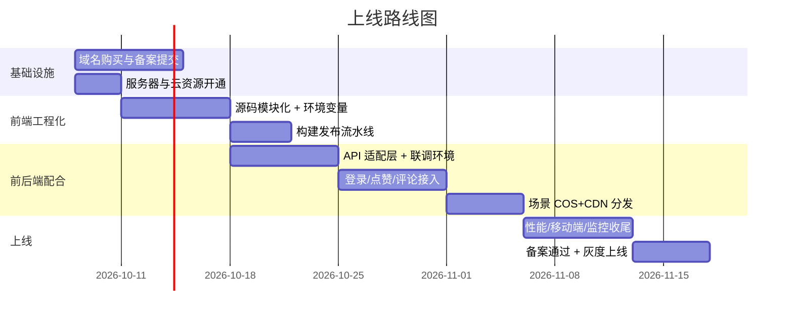
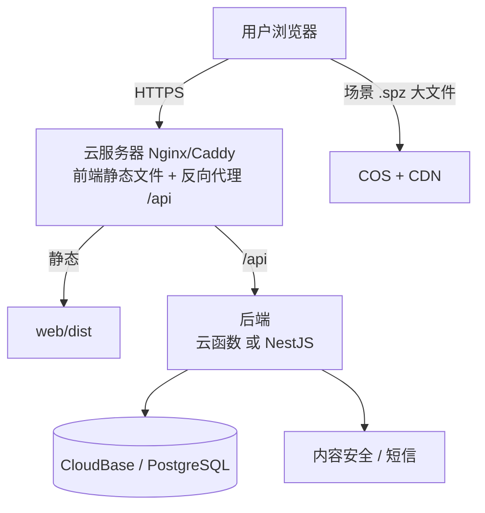

# fuxi-onlinemuseum 生产化上线规划

> 目标：把当前的 demo 级静态页面，升级为**挂正式网址、前后端配合、可公开运营**的完整项目。
> 后端技术选型见 [backend-selection.md](./backend-selection.md)（结论：腾讯 CloudBase 起步 → 按需自建 NestJS）。
> 本文只讲"上线"这件事怎么规划。

---

## 1. 现状 → 目标的差距

| 维度 | 现在（demo） | 上线后（目标） |
|---|---|---|
| 访问方式 | github.io（慢、不专业） | 自有域名 + 国内 CDN，微信里可正常打开 |
| 数据 | 全部写死 | 后端数据库（见选型文档） |
| 场景 | 单个写死 scene.ply | 多场景，对象存储 + CDN 分发 |
| 工程 | 单文件 main.js + 手工 esbuild | 模块化源码 + 一键构建 + 环境区分 + 可回滚 |
| 质量 | 无监控、无统计、无兼容策略 | 错误上报、访问统计、移动端可用、加载兜底 |
| 合规 | 无 | ICP 备案、隐私声明、内容审核 |

---

## 2. 总里程碑（约 5~6 周，业余时间）



> 备案是周期最不可控的一环（1~2 周，管局审核），**第一天就提交**，其余工作并行。

---

## 3. 域名、备案与合规

1. **域名**：阿里云/腾讯云买一个（`.com`/`.cn`，约 50~80 元/年）。实名认证当天可完成。
2. **ICP 备案**：服务器在国内（腾讯云）就必须备案；在云厂商控制台提交，需要域名、身份证、手机，**1~2 周**。备案期间网站不能解析到国内服务器，所以先开发后切流量。
3. **上线后页面底部**放备案号（如 `京ICP备xxxxxxx号`）并链接到工信部 site。
4. **隐私声明**：如果做手机号登录，需要一个简单的隐私政策页。
5. 微信内打开：自有域名 + HTTPS + 备案后，分享卡片才稳定（github.io 链接在微信里常被提示"非官方页面"）。

---

## 4. 前端工程化改造（把 demo 变成可维护的项目）

现在：`index.html + css/style.css + js/main.js(单文件) + dist/bundle.js`。
改造为：

```
web/                      ← 前端源码目录
  index.html
  css/style.css
  js/
    main.js               ← 入口（现有逻辑拆分）
    api.js                ← 全部后端调用集中在这里（axios/fetch 封装 + baseURL）
    viewer.js             ← 3D 查看器（mkkellogg 封装）
    controls.js           ← 第一人称控制（鼠标视角/WASD/跳跃）
    ui.js                 ← 菜单/搜索/toast 等 HUD 逻辑
  config/
    env.js                ← 由构建注入：API 地址、场景 CDN 地址
tools/                    ← 已有的 spz/ply 工具（不动）
```

改造清单：

- [ ] **API 适配层**：所有 `fetch` 走 `api.js`，`baseURL` 从环境变量读（本地 `http://localhost:3000`，线上 `https://api.fuxi3d.cn`）。这是前后端配合的**唯一接口面**，做对了以后换后端零成本
- [ ] **构建脚本**：`package.json` 里 `build` = esbuild 打包 + 产物文件名带内容 hash（`bundle.[hash].js`）→ 浏览器缓存永不冲突
- [ ] **环境区分**：`dev / staging / prod` 三套配置；dev 直连本地后端
- [ ] **版本可回滚**：每次发布打 git tag；静态资源重新上传即回滚
- [ ] **加载兜底**：WebGL2 不可用时显示提示页；场景加载失败显示重试按钮（现在只有一句文字）
- [ ] **移动端交互**：目前 FPS 在手机上降级为轨道操作——正式版需要设计触摸方案（左半屏虚拟摇杆 + 右半屏滑动视角，或保持轨道模式但优化）

> 判断标准：换一台没配过环境的电脑，`npm install && npm run build && npm run deploy` 三条命令能完成全部发布，就算改造完成。

---

## 5. 部署架构（推荐形态）



| 组件 | 选择 | 月成本 | 说明 |
|---|---|---|---|
| 前端 + 反代 | 腾讯云轻量服务器 2C2G | 50~112 元 | Nginx 托管静态 + `/api` 反代到后端 |
| 场景文件 | COS + CDN | 按流量 ≈0.2 元/GB | spz 格式 11MB，1000 次浏览 ≈ 3 元 |
| 后端 | CloudBase 云函数（第一阶段） | 0~39 元 | 之后可平滑换成同服务器上的 NestJS |
| HTTPS | 云厂商免费证书 / Let's Encrypt | 0 | 自动续期 |
| 域名 | — | 50~80 元/年 | — |

> 过渡技巧：备案没下来前，前端可以先继续挂 GitHub Pages，后端先用 CloudBase 的默认域名联调；备案通过后统一切自有域名。

---

## 6. 前后端配合约定

1. **接口契约先行**：每个接口写清"请求/响应/错误码"（推荐用 Apifox，国内团队免费，可生成 mock）——**后端没好的时候前端对着 mock 开发**，互不阻塞
2. **联调环境**：本地开发走 `dev` 配置直连后端开发者本机或测试环境；`staging` 用于上线前验收；`prod` 只吃 git tag 发布
3. **鉴权流程**：登录拿 token → `api.js` 统一带上 → 401 时静默刷新或跳登录
4. **CORS**：后端只允许 `https://fuxi3d.cn`（和本地 dev 地址）；生产绝不用 `*`
5. **错误约定**：统一响应结构 `{ code, data, message }`，前端 toast 展示 `message`

---

## 7. 性能与体验（上线前必做）

- [ ] 场景文件全部用 **SPZ**（46MB→11MB）并上传 COS + CDN
- [ ] `index.html` 内联关键 CSS（首屏 splash 不闪白）
- [ ] 3D 资源加 `preload` 提示；加载进度条真实化（现在用估算）
- [ ] **错误监控**：`window.onerror` 上报到后端一个小接口（谁、哪页、什么错），没有这个，线上出问题你就是最后一个知道的
- [ ] **访问统计**：接入百度统计/自建计数（浏览量要展示，得有真实来源）
- [ ] 弱网测试：CDN 挂了/超时时，页面能进、能提示、能重试
- [ ] 移动端真机过一遍（微信内置浏览器 X5 内核兼容性重点测 WebGL）

---

## 8. 上线 Checklist（发布当天逐项打勾）

- [ ] 域名解析生效，HTTPS 绿锁，HTTP 自动跳 HTTPS
- [ ] 备案号在页脚，链接工信部
- [ ] 标题/OG 标签正确（微信转发卡片实测一遍）
- [ ] 登录 → 点赞 → 评论 → 切换场景 全流程真机走通
- [ ] 错误监控收到心跳（说明上报通了）
- [ ] 数据库自动备份已开启
- [ ] 回滚方案演练过一遍（把上一版 dist 重新上传 ≤ 5 分钟）
- [ ] 默认管理员密码已改，云密钥不在代码里

---

## 9. 上线后运营迭代

- 每周看一次错误监控 + 访问统计，先修影响浏览的
- 内容更新流水线：新场景 → `rotate-ply`/`ply-meta` 校正 → 上传 COS → 后台建空间 → 前台出现（全流程目标 10 分钟内）
- 反馈入口：菜单里加"问题反馈"（直接写进 comments 表，标 `type=feedback`）
- 半年后再评估：是否需要自建后端、是否上推荐/多人在线

---

## 10. 预算汇总（第一年）

| 项 | 金额 |
|---|---|
| 域名 | 60~80 元/年 |
| 轻量服务器 | 600~1300 元/年 |
| COS + CDN 流量 | 按量，初期 ≈ 30~50 元/月 |
| CloudBase / 数据库 | 0~39 元/月 |
| 短信验证码 | ≈0.05 元/条 |
| **合计** | **约 1500~3000 元/年**（流量增长后主要涨在 CDN） |

---

## 11. 风险清单

| 风险 | 应对 |
|---|---|
| 备案被驳回 | 材料按云厂商指引准备；驳回常见于网站名称/内容描述，可改"3D 展览展示"类目 |
| 微信内 WebGL 兼容 | 上线前真机矩阵测试；保留"使用系统浏览器打开"引导 |
| 场景文件被盗链 | CDN 开 Referer 白名单 + 链接签名 |
| 无人维护宕机 | 轻量服务器自带监控告警；开机自动拉起（systemd/Docker restart） |
| 内容合规 | 用户评论接内容安全 API，先审后显或先显后删都可，但要有删除能力 |
